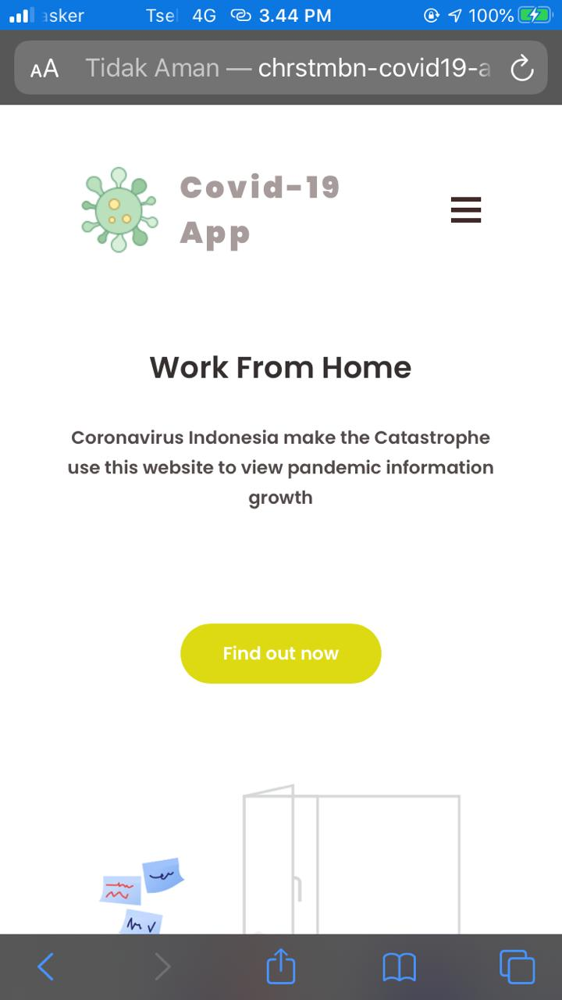
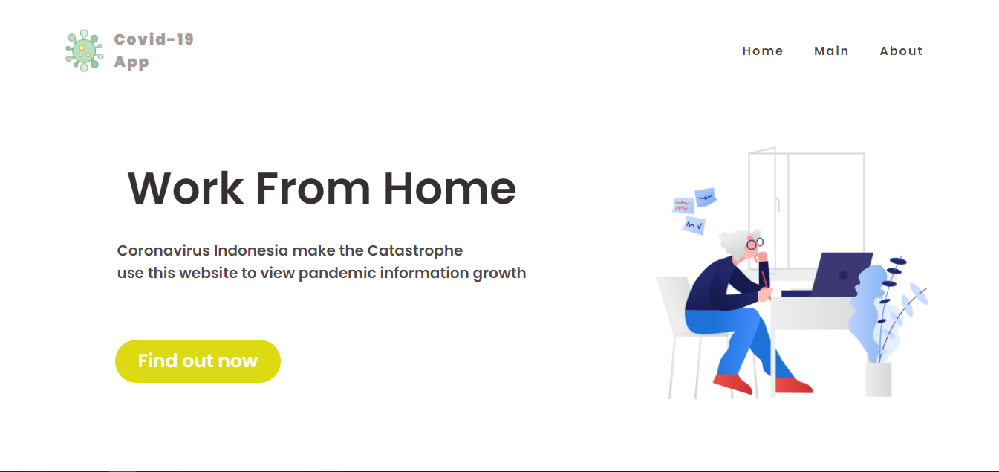
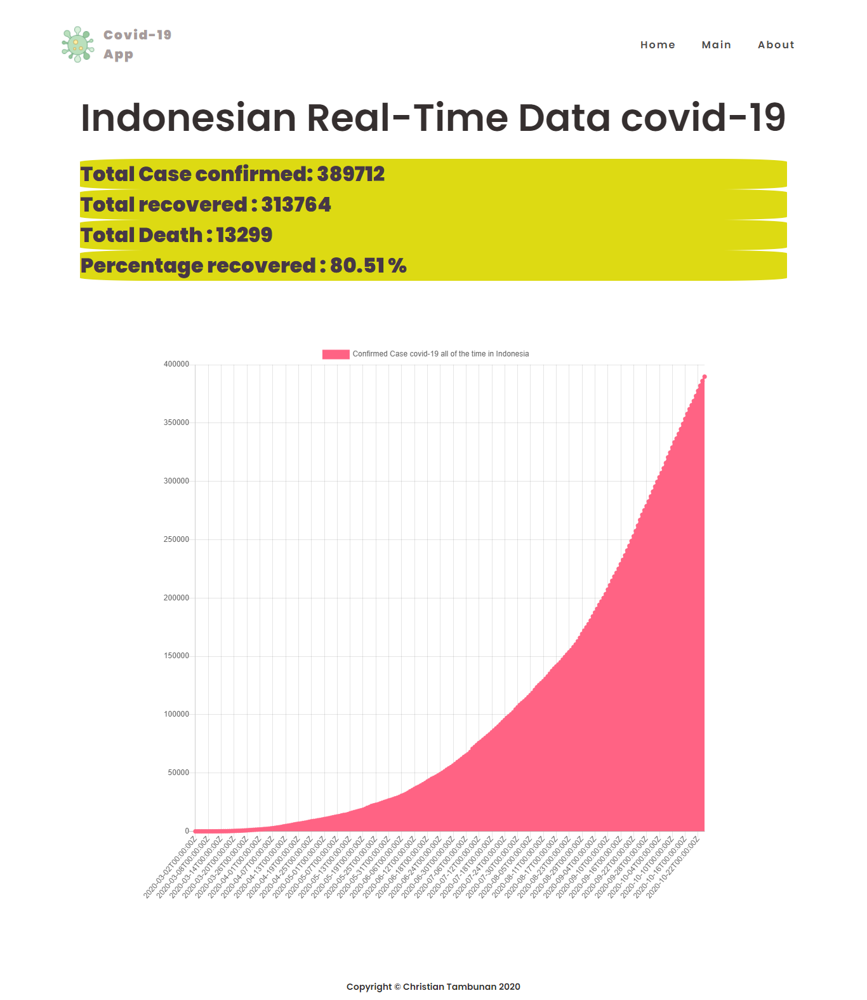

# Covid19-app

<h1 align="center">
   
  
</h1>

<h4 align="center">A web app based on node.js</h4>

a website that displays confirmed cases  covid 19 in Indonesia  all of the time :rocket:

# Demo
👉 Click it <a href="https://chrstmbn-covid19-app.herokuapp.com/">here</a>.:point_left:
 

## mobile

## non-mobile

## API
postman-covid19 api

## License

MIT  © Christian :v: :v: :v:
